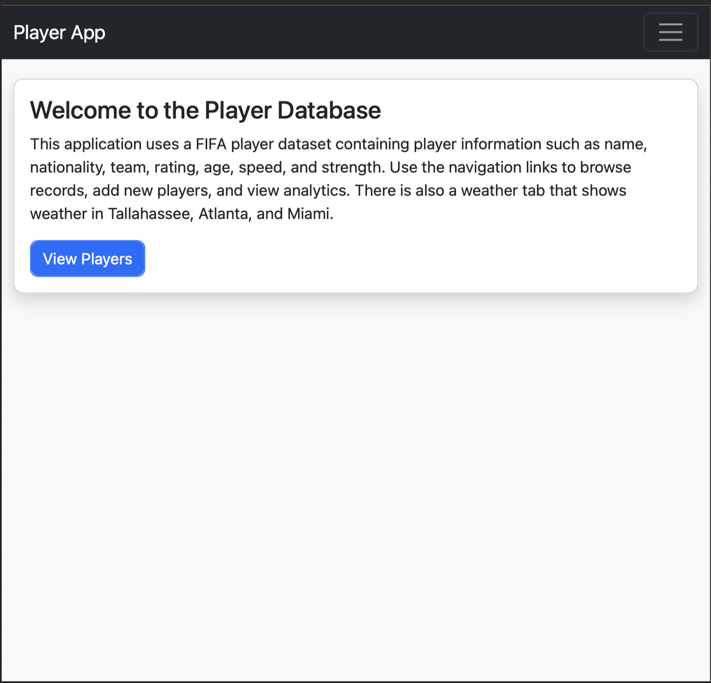
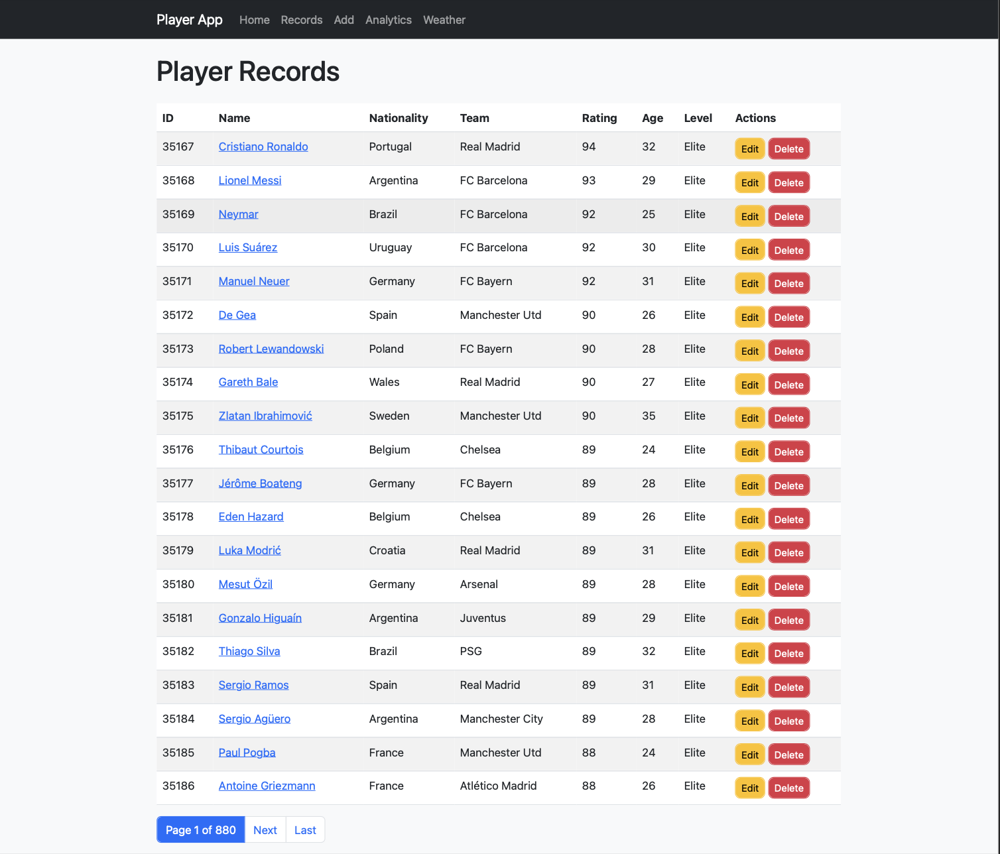
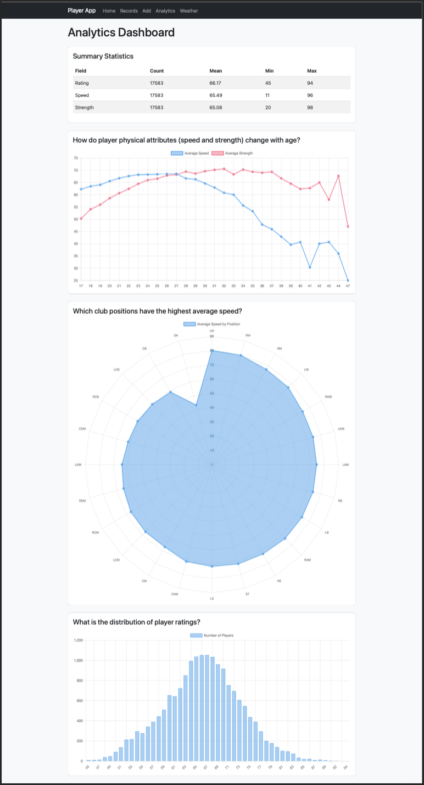
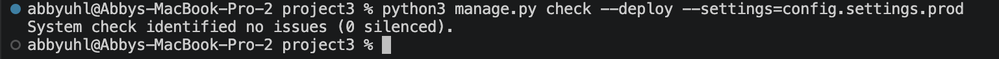

# Data Web Application (Django Project)

## By Abigail Uhl ATU22

## Project Description
This project is a full-stack Django web application that analyzes FIFA player data.  
It allows users to view, create, update, and delete player records, as well as explore analytics based on player performance metrics such as speed, strength, and age. There is also a weather data aspect, that shows API ingestion.

The application integrates:
- Project 1: FIFA dataset and EDA analysis
- Project 2: API data fetching (weather data)
- Django: Full web interface with CRUD, analytics, and UI

## Dataset & API
- Dataset (Project 1): 
    FIFA Player Dataset (cleaned_players.csv)
    https://www.kaggle.com/datasets/artimous/complete-fifa-2017-player-dataset-global
- API (Project 2): 
    Weather API (Open-Meteo)
    https://open-meteo.com/en/docs

## Application Features

### Core Pages
- Home page (`/`)
- Player list view with pagination (`/records/`)
- Player detail view (`/records/<pk>/`)
- Add player (`/records/add/`)
- Edit player (`/records/<pk>/edit/`)
- Delete player (`/records/<pk>/delete/`)

### Analytics
- Analytics dashboard (`/analytics/`)
- Player distribution by position (bar chart)
- Average speed by club (bar chart)
- Summary statistics table (mean, min, max, etc.)

### API Integration
- Fetch API data (`/fetch/`)
- Django management command: 
    'python3 manage.py fetch_data'

## Setup Instructions

### 1. Clone the repository
`git clone https://github.com/AbigailUhl/Group-24-Python-Projects'
'cd project3'

## 2. Create virtual enviornment
'python3 -m venv venv'
'source venv/bin/activate'

### 3. Install dependencies
'pip3 install -r requirements.txt'

### 4. Run migrations
'python3 manage.py migrate'

### 5. Load intitial dataset
'python3 manage.py seed_data'

### 6. Run development server
'python3 manage.py runserver'

### 7. Open browser
'http://127.0.0.1:8000/'

## Screenshots
### Homepage

### List View

### Analytics Dashboard

## Deployment Check
'python3 manage.py check --deploy --settings=config.settings.prod'
Expected Output: 'System check identified no issues (0 silenced).'

## Project Structure
project3/
│── config/
│   └── settings/
│       ├── base.py
│       ├── dev.py
│       └── prod.py
│
│── myapp/
│   ├── models.py
│   ├── views.py
│   ├── forms.py
│   ├── urls.py
│   ├── templates/myapp/
│   ├── static/css/
│   └── management/commands/
│
│── data/raw/
│── requirements.txt
│── README.md

